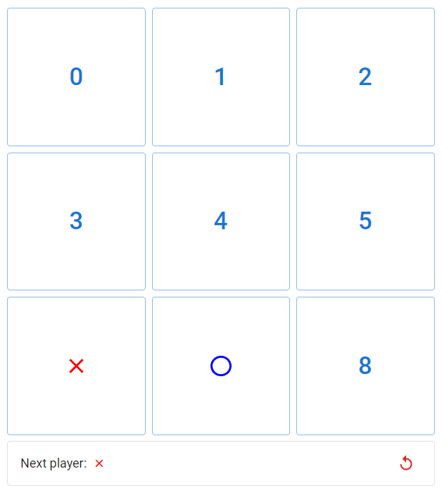
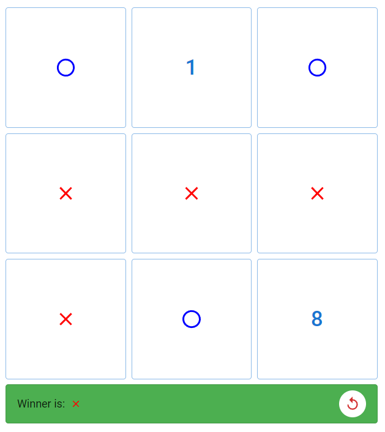

# Task 05 - React basics

Your task for this lesson is to implement a simple Tic Tac Toe game by using basic concepts of React combined with the help of Material UI.

- Complete the `Board`, `Square` and `PlayerIcon` components
- Add `getWinner` function (try to come up with a different solution than [this one](https://reactjs.org/tutorial/tutorial.html#declaring-a-winner))
- Add the `Status` component that shows which player's turn it is, shows winner info and contains the restart button

## Hints

- Use the `sx` prop to provide additional styling
- Use `as const` to interpret static values as literal types
  ```ts
  let foo = [1]; // type: number[]
  let goo = [1] as const; // type: [1]
  ```
- Preview of how next player status could look like

  

- Preview of how winner status could look like

  
